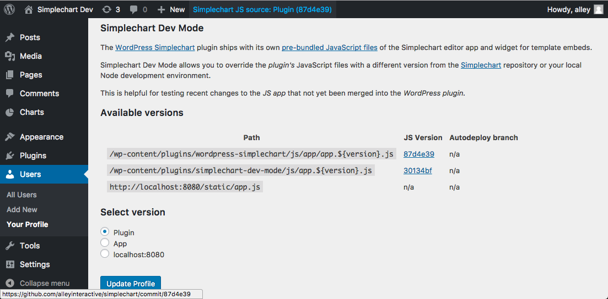

# Simplechart Dev Site
- [Changing JS versions](#changing-js-versions)
- [Local JS app development](#local-js-app-development)
- [Local WordPress plugin development](#local-wordpress-plugin-development)
- [Automated deployments](#automated-deployments)

This repo exists to help with local development for the [Simplechart][1] JS app and the [WordPress Simplechart][2] plugin.

## Changing JS versions

The Simplechart Dev Mode plugin (`plugins/simplechart-dev-mode`) is the important thing in this repo. When it's activated, you'll find this option in your user settings.



Note that the WordPress toolbar indicates which version of the JS source is active.

## Local JS app development

First get the local Node environment running:

```
$ git clone git@github.com:alleyinteractive/simplechart.git
$ cd simplechart
$ npm install
$ npm run watch
```
Then in your local WordPress site:

1. Go to `/wp-admin/profile.php`
1. Select `localhost:8080` under **Simplechart Dev Mode**
1. Go to `/wp-admin/post-new.php?post_type=simplechart`
1. The chart editor app should open from `http://localhost:8080/static/app.js`

## Local WordPress plugin development

The WordPress Simplechart plugin is set up as a Git submodule. So any changes you make in `plugins/wordpress-simplechart` are tracked by `git@github.com:alleyinteractive/wordpress-simplechart.git`; the `simplechart-dev-site` repository only tracks a reference to the Git history of the submodule repo.

Here's how to make changes to the plugin and then update this repository:

```
# Start by updating the local submodule (installing first if needed)
$ git submodule update --init
$ cd plugins/wordpress-simplechart
$ git remote -v
# Should tell you git@github.com:alleyinteractive/wordpress-simplechart.git
# checkout branches, commit changes, pull request, etc
$ cd ..
$ git remote -v
# Should tell you git@github.com:alleyinteractive/simplechart-dev-site.git
$ git status
# On branch XXXXXXXX
# Changes not staged for commit:
#   (use "git add <file>..." to update what will be committed)
#   (use "git checkout -- <file>..." to discard changes in working directory)
#
#	modified:   wordpress-simplechart (new commits)
#
#no changes added to commit (use "git add" and/or "git commit -a")
$ git commit -am "udpate wordpress-simplechart plugin"
# push to github...
```

**Note:** You _can_ do local JS app development and WordPress plugin development at the same time

## Automated deployments

The `master` branch of this repo is automatically deployed from GitHub to http://dev-simplechart.alleydev.com/, **except for**:

* `plugins/wordpress-simplechart` (`develop` branch of [alleyinteractive/wordpress-simplechart][2])
* `plugins/simplechart-dev-mode/js` (`develop` branch of [alleyinteractive/simplechart][2])

[1]: https://github.com/alleyinteractive/simplechart
[2]: https://github.com/alleyinteractive/wordpress-simplechart
[3]: https://github.com/alleyinteractive/simplechart-dev-site
